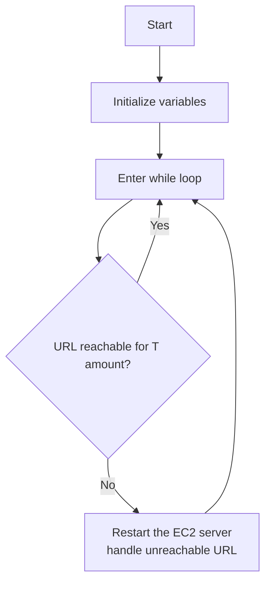

# EC2 Maintainer

This is a simple script that will stop and start EC2 instances if it fails to GET a particular URL. This is useful for maintaining EC2 instances that are not behind a load balancer.


## Flowchart



## Configuration

Since whole point is to maintain EC2 instnace. this is made to be hosted on a different machine. that have no connection to the EC2 instance you are monitoring.
```
{
    "i-03cdcee6a9ea8be78": {
        "location": {
            "url": "https://streamsnip.com",
            "headers": {},
            "response_code" : 200,
            "timeout" : 10
        },
        "ec2":{
            "region": "us-east-2",
            "aws_access_key_id": "ASF125GASSEQ23",
            "aws_secret_access_key": "asdasdsadasdcqwwe12rsdgs"
        },
        "interval": 60,
        "tolerance" : 10,
        "discord": "https://discord.com/api/webhooks/1205223388512124990/ub640V3iN-"
    }
}
```
Example configuration. You can get aws acccess key id and access key from [here](https://us-east-1.console.aws.amazon.com/iamv2/home?region=us-east-1#/security_credentials/access-key-wizard)

## Installation

```bash
pip install -r requirements.txt
```

## Usage

```bash
python main.py
```

## Crontab
```bash
@reboot cd /root/ec2_maintainer && nohup python3 main.py & 
```

